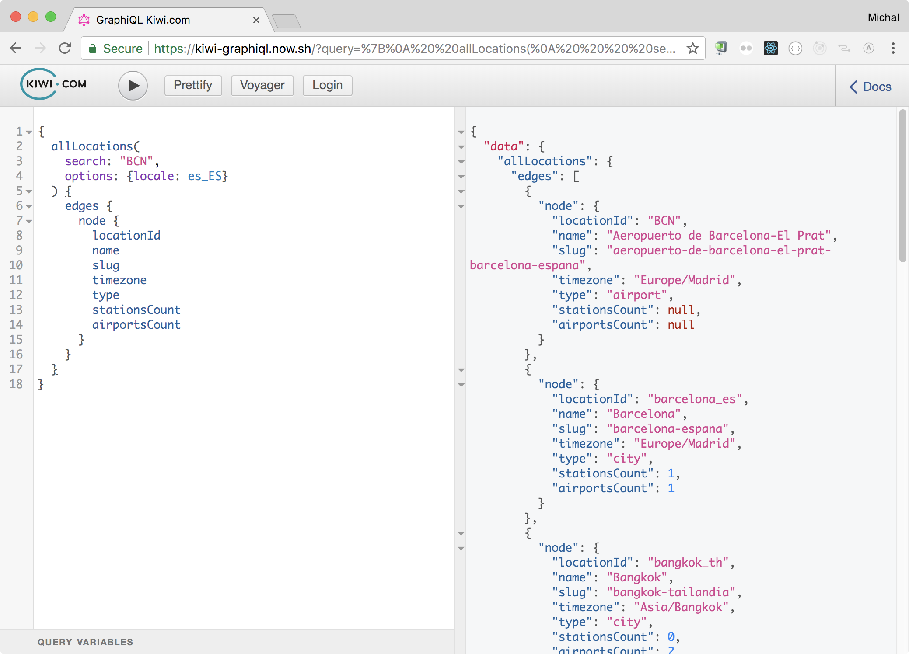

# GraphQL in Kiwi.com
## Tips and tricks
### Michal Sänger

^
Hi my name is...

^
No theory, just a practical stuff

---

# Why?

- Easy on-boarding
- Handy tools
- Bright future

^
Don't use new technology because of this!

^
Use it because it solves problem. Fetching data for chatbot was a problem

---

# Wild Wild REST

^
REST works, but sucks during the time

^
Let's see Kiwi.com as example

---

# Wild Wild REST

- docs.skypickerpublicapi.apiary.io
- docs.skypickerbookingapi1.apiary.io
- docs.locations10.apiary.io

^
Plus some private and undocumented

---

# Wild Wild REST

- WTF factor > 0
- Docs get old
- Versioning
- Over fetching

^
More endpoints have to be called for simple usecase

^
Optimizations on web (bundling, CDN) must be done again on mobile. If lucky

---
# How

- Proxy REST API
- Serverless

---


---


^
This is cool, but best we did was Wish Driven Development

---

# Wish driven development

^
REST is static, GQL schema gives options. Combine what's available!

^
Entities + relations + queries + fantasy

^
Easy experiments in product. Optimize once. Measure!

---

# How

New project? - [www.graph.cool](https://www.graph.cool)

^
GraphQL backend as a service

---

# Tools

- Apollo Optics
- GraphQL Voyager
- GraphiQL

---

# GraphQL Voyager

---


^
Whole picture. Schema visualisation

^
Generated from code, can't get old

---


---


^
Documentation. Generated from code, can't get old

---

# GraphiQL

---


^
Gateway to all API available. Like SQL console

^
It's a React component, extensible (Voyager, Login)

---



^
Autocomplete, Docs generated from code, can't get old

---

# Code

- Flow type
- Relay pagination
- Tests, mocked API responses

^
Static types helps refactoring, code navigation, code analysis

^
Standard navigation, FE can easyly jump on board

^
Tests are a must, be sure resolvers works

---

# Dataloader

- Data fetching lib
- Batching
- Caching

^
Don't be sad because of bad REST API

---

# Dataloader

```javascript
{
  allBookings(last: 2) {
    edges {
      node {
        id
        allowedBaggage {
          additionalBaggage {
            price {
              amount
              currency
            }
            quantity
          }
        }
      }
    }
  }
}
```

^
I'd like to know how much does it cost to add baggage to my 2 latest bookings

^
note: Relay pagination usage

---

# Dataloader

```javascript, [.highlight: 6-13]
{
  allBookings(last: 2) {
    edges {
      node {
        id
        allowedBaggage {
          additionalBaggage {
            price {
              amount
              currency
            }
            quantity
          }
        }
      }
    }
  }
}
```

^
REST API requires - fetch list of bookings, filter latest 2, twice fetch detail.

^
Thanks to GQL allowedBaggage resolver is called only for latest 2 bookings,
Thanks to Dataloader detail fetch can be batched. Or fetched from Redis if it makes sense.

^
This optimisation does not have to be done on web and mobile and every other platform.

---

# Dataloader

[github.com/facebook/dataloader](https://github.com/facebook/dataloader)

---

# Future

- Use on Kiwi.com and Mobile app
- Subscriptions via AWS
- Rate limiting

^
Technology is easy, people are hard :-)

^
Subscriptions are cool, make it scalable is a chalange

^
Static analyze the query, refuse to execute if too much data is requested

---

# Thanks
## [kiwi-graphiql.now.sh](https://kiwi-graphiql.now.sh/)

### `michal.sanger@kiwi.com`

^
Give GraphQL a try. Idealy with me in Kiwi.com :-)

^
And last thing on the next slide...

---
# [howtographql.com](https://www.howtographql.com)

