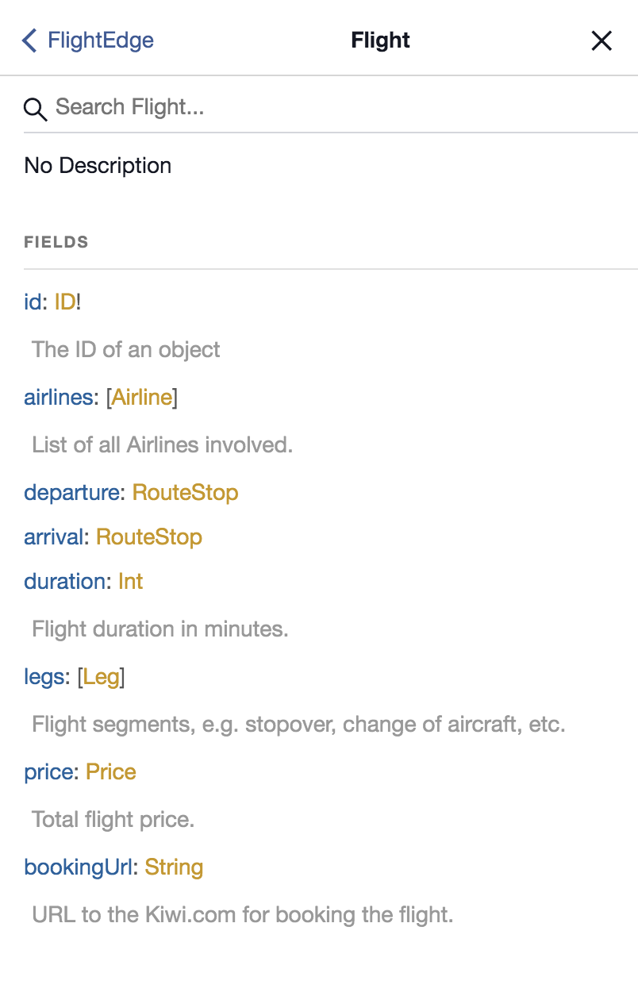

# GraphQL in Kiwi.com
## Tips and tricks
### Michal Sänger

^
Hi my name is...

^
No theory, just a practical stuff

---

# Why?

- Easy on-boarding
- Developer experience
- Handy tools
- Bright future

^
Don't use new technology because of this!

^
Use it because it solves problem. Fetching data for chatbot was a problem

---

^
- So you are attracted by a GraphQL
- But what about the current setup?

---

# Wild Wild REST

^
REST works, but sucks during the time

^
Let's see Kiwi.com as example

---

# Wild Wild REST

- docs.skypickerpublicapi.apiary.io
- docs.skypickerbookingapi1.apiary.io
- docs.locations10.apiary.io

^
Plus some private and undocumented

---

# Wild Wild REST

- WTF factor
- Docs get old
- Versioning
- Over fetching

^
More endpoints have to be called for simple usecase

^
Optimizations on web (bundling, CDN) must be done again on mobile. If lucky

---
# How

- Proxy REST API
- Serverless

---

---

^
This is cool, but best we did was Wish Driven Development

---

# Wish driven development

^
REST is static, GQL schema gives options. Combine what's available!

^
Entities + relations + queries + fantasy

^
Easy experiments in product. Optimize once. Measure!

---

# Tools

---

# GraphiQL

---

^
- Build from schema, always fresh
- Something like API console

---

^
- Available queries
- Props of Flight entity

---

^
Autocomplete

---

^
OFC run queries, see the data

---

# GraphQL Voyager

---

^
Whole picture. Schema visualisation

^
Generated from code, can't get old

---

---

^
Documentation. Generated from code, can't get old

---

# Apollo Engine

---

^
Performance monitoring
Dashboard overview

---

^
Query stats
Time stats
Frequency stats

---

^
Single query detail

---

^
- Query parameters
- Analyze problem to the detail

---

^
- No change on BE
- Closed Source, we'll try open source

---

# Code

- Flow type
- Relay pagination
- Tests, mocked API responses

---

# [fit] _`github.com/kiwicom/graphql`_

---

# GraphQL in Kiwi.com

- Locations on Kiwi.com
- Hotels in Mobile app
- Customer Support
- FAQ soon

^
Technology is easy, people are hard :-)

^
Subscriptions are cool, make it scalable is a chalange

^
Static analyze the query, refuse to execute if too much data is requested

---

# Thanks
## [kiwi-graphiql.now.sh](https://kiwi-graphiql.now.sh/)

### `michal.sanger@kiwi.com`

^
Give GraphQL a try. Idealy with me in Kiwi.com :-)

^
And last thing on the next slide...

---
# [howtographql.com](https://www.howtographql.com)

